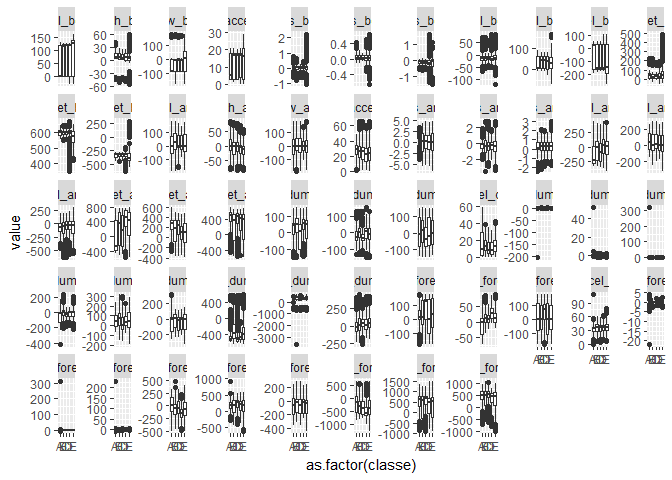
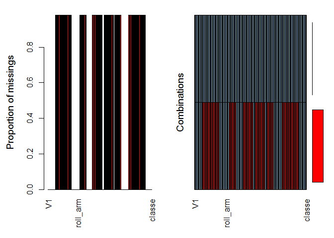
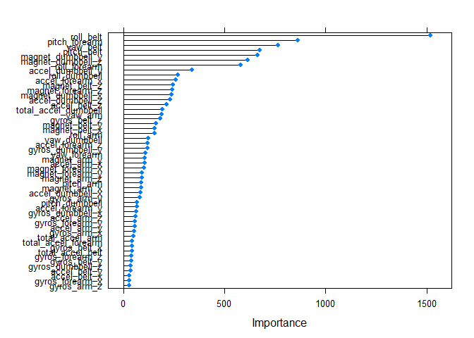

# week4_prediction
Vinay Mahajan  
December 5, 2016  


# Device data analysis
Using devices such as Jawbone Up, Nike FuelBand, and Fitbit it is now possible to collect a large amount of data about personal activity relatively inexpensively. These type of devices are part of the quantified self movement

## Read the data from given location, data cleaning and set-up

[Training.csv](https://d396qusza40orc.cloudfront.net/predmachlearn/pml-training.csv)  
[Testing.csv](https://d396qusza40orc.cloudfront.net/predmachlearn/pml-testing.csv)  

```r
library(data.table)
library(VIM)
```

```
## Warning: package 'VIM' was built under R version 3.3.2
```

```r
library(Hmisc)
```

```
## Warning: package 'Hmisc' was built under R version 3.3.2
```

```
## Warning: package 'lattice' was built under R version 3.3.2
```

```
## Warning: package 'survival' was built under R version 3.3.2
```

```
## Warning: package 'Formula' was built under R version 3.3.2
```

```
## Warning: package 'ggplot2' was built under R version 3.3.2
```

```r
library(caret)
```

```
## Warning: package 'caret' was built under R version 3.3.2
```

```r
library(ggplot2)

setwd("C:\\Users\\VinayMahajan\\Desktop\\Misc\\Coursera Data Science\\week4machinelearning")

train <- fread("pml-training.csv", na.strings = c("NA", "", " "))
test <- fread("pml-testing.csv", na.strings = c("NA", "", " "))

train2 <- train[, colSums(is.na(train)) == 0, with =FALSE]
train3 <- data.table( na.omit(train2) )

test2 <- test[, colSums(is.na(test)) == 0, with =FALSE]
test3 <- data.table( na.omit(test2) )

dim(train3)
dim(test3)

names(train3)

train4 <- melt(data = train3, 
               id.vars =c("V1", "user_name", "classe",            
                        "raw_timestamp_part_1", "raw_timestamp_part_2",
                        "cvtd_timestamp", "new_window", "num_window" ))
```

```
## Warning in melt.data.table(data = train3, id.vars = c("V1", "user_name", :
## 'measure.vars' [roll_belt, pitch_belt, yaw_belt, total_accel_belt,
## gyros_belt_x, gyros_belt_y, gyros_belt_z, accel_belt_x, accel_belt_y,
## accel_belt_z, magnet_belt_x, magnet_belt_y, magnet_belt_z, roll_arm,
## pitch_arm, yaw_arm, total_accel_arm, gyros_arm_x, gyros_arm_y,
## gyros_arm_z, accel_arm_x, accel_arm_y, accel_arm_z, magnet_arm_x,
## magnet_arm_y, magnet_arm_z, roll_dumbbell, pitch_dumbbell, yaw_dumbbell,
## total_accel_dumbbell, gyros_dumbbell_x, gyros_dumbbell_y, gyros_dumbbell_z,
## accel_dumbbell_x, accel_dumbbell_y, accel_dumbbell_z, magnet_dumbbell_x,
## magnet_dumbbell_y, magnet_dumbbell_z, roll_forearm, pitch_forearm,
## yaw_forearm, total_accel_forearm, gyros_forearm_x, gyros_forearm_y,
## gyros_forearm_z, accel_forearm_x, accel_forearm_y, accel_forearm_z,
## magnet_forearm_x, magnet_forearm_y, magnet_forearm_z] are not all of the
## same type. By order of hierarchy, the molten data value column will be of
## type 'double'. All measure variables not of type 'double' will be coerced
## to. Check DETAILS i [... truncated]
```

```r
ggplot(train4) + 
  geom_boxplot(aes(x=as.factor(classe), y=value )) +
  facet_wrap(~ variable, scales ="free_y", nrow=5)
```

<!-- -->

```r
aggr(train)
```

<!-- -->

```r
summary(aggr(train3, sortVars = TRUE, plot =FALSE))
```

## Analysis of the available data, splitting of data
In order to get out-of-sample errors, we split the cleaned training set trainData into a training set (train, 70%) for prediction and a validation set (valid 30%) to compute the out-of-sample errors.

```r
train5 <- train3 [,-c(1:7), with = FALSE]
test5 <- test3 [, -c(1:7), with = FALSE]

set.seed(11111)
inTrain <- createDataPartition(train5$classe, p = 0.7, list = FALSE)
train6 <- train5[inTrain, ]
valid6 <- train5[-inTrain, ]
```

## Prediction Algorithms
Let using 3 different algorithms

## Method: Generalized Boosted Model

```r
controllda <- trainControl(method="cv", number=3)
modFitlda <- train(classe ~ ., 
                    data=train6, 
                    method = "lda",
                    trControl=controllda, 
                    verbose = FALSE)
modFitlda$finalModel

predlda <- predict(modFitlda, newdata=valid6)
cmlda <- confusionMatrix(predlda, valid6$classe)
```

## Model: Random forest

```r
# model fit
set.seed(11111)
controlRF <- trainControl(method="cv", number=3)
modFitRF <- train(classe ~ ., 
                          data=train6, 
                          method="rf",
                          ntree=100,
                          trControl=controlRF)
```

```
## Warning: package 'randomForest' was built under R version 3.3.2
```

```r
modFitRF$finalModel

predRF <- predict(modFitRF, newdata=valid6)
cmRF <- confusionMatrix(predRF, valid6$classe)
```

## Model: GBM

```r
controlGBM <- trainControl(method="cv", number=3)
modFitGBM <- train(classe ~ ., 
                          data=train6, 
                          method="gbm",
                          trControl=controlGBM)
```

```
## Warning: package 'gbm' was built under R version 3.3.2
```

```r
modFitGBM$finalModel


predGBM <- predict(modFitGBM, newdata=valid6)
cmGBM <- confusionMatrix(predGBM, valid6$classe)
```

## Use accuracy measure to determine best model

```r
cmlda
```

```
## Confusion Matrix and Statistics
## 
##           Reference
## Prediction    A    B    C    D    E
##          A 1357  172  106   61   46
##          B   41  740  101   39  181
##          C  138  135  669  128   92
##          D  134   35  129  698   96
##          E    4   57   21   38  667
## 
## Overall Statistics
##                                           
##                Accuracy : 0.702           
##                  95% CI : (0.6901, 0.7136)
##     No Information Rate : 0.2845          
##     P-Value [Acc > NIR] : < 2.2e-16       
##                                           
##                   Kappa : 0.6228          
##  Mcnemar's Test P-Value : < 2.2e-16       
## 
## Statistics by Class:
## 
##                      Class: A Class: B Class: C Class: D Class: E
## Sensitivity            0.8106   0.6497   0.6520   0.7241   0.6165
## Specificity            0.9086   0.9237   0.8985   0.9199   0.9750
## Pos Pred Value         0.7790   0.6715   0.5757   0.6392   0.8475
## Neg Pred Value         0.9235   0.9166   0.9244   0.9445   0.9186
## Prevalence             0.2845   0.1935   0.1743   0.1638   0.1839
## Detection Rate         0.2306   0.1257   0.1137   0.1186   0.1133
## Detection Prevalence   0.2960   0.1873   0.1975   0.1856   0.1337
## Balanced Accuracy      0.8596   0.7867   0.7753   0.8220   0.7957
```

```r
cmGBM
```

```
## Confusion Matrix and Statistics
## 
##           Reference
## Prediction    A    B    C    D    E
##          A 1649   46    0    0    0
##          B   16 1064   34    0    9
##          C    7   28  979   36   14
##          D    1    1   12  926   18
##          E    1    0    1    2 1041
## 
## Overall Statistics
##                                           
##                Accuracy : 0.9616          
##                  95% CI : (0.9564, 0.9664)
##     No Information Rate : 0.2845          
##     P-Value [Acc > NIR] : < 2.2e-16       
##                                           
##                   Kappa : 0.9514          
##  Mcnemar's Test P-Value : 4.123e-11       
## 
## Statistics by Class:
## 
##                      Class: A Class: B Class: C Class: D Class: E
## Sensitivity            0.9851   0.9342   0.9542   0.9606   0.9621
## Specificity            0.9891   0.9876   0.9825   0.9935   0.9992
## Pos Pred Value         0.9729   0.9475   0.9201   0.9666   0.9962
## Neg Pred Value         0.9940   0.9843   0.9903   0.9923   0.9915
## Prevalence             0.2845   0.1935   0.1743   0.1638   0.1839
## Detection Rate         0.2802   0.1808   0.1664   0.1573   0.1769
## Detection Prevalence   0.2880   0.1908   0.1808   0.1628   0.1776
## Balanced Accuracy      0.9871   0.9609   0.9683   0.9770   0.9806
```

```r
cmRF
```

```
## Confusion Matrix and Statistics
## 
##           Reference
## Prediction    A    B    C    D    E
##          A 1672    6    0    0    0
##          B    0 1131    5    0    2
##          C    2    2 1016    9    1
##          D    0    0    5  954    3
##          E    0    0    0    1 1076
## 
## Overall Statistics
##                                           
##                Accuracy : 0.9939          
##                  95% CI : (0.9915, 0.9957)
##     No Information Rate : 0.2845          
##     P-Value [Acc > NIR] : < 2.2e-16       
##                                           
##                   Kappa : 0.9923          
##  Mcnemar's Test P-Value : NA              
## 
## Statistics by Class:
## 
##                      Class: A Class: B Class: C Class: D Class: E
## Sensitivity            0.9988   0.9930   0.9903   0.9896   0.9945
## Specificity            0.9986   0.9985   0.9971   0.9984   0.9998
## Pos Pred Value         0.9964   0.9938   0.9864   0.9917   0.9991
## Neg Pred Value         0.9995   0.9983   0.9979   0.9980   0.9988
## Prevalence             0.2845   0.1935   0.1743   0.1638   0.1839
## Detection Rate         0.2841   0.1922   0.1726   0.1621   0.1828
## Detection Prevalence   0.2851   0.1934   0.1750   0.1635   0.1830
## Balanced Accuracy      0.9987   0.9958   0.9937   0.9940   0.9971
```

```r
Accuracy <- data.frame(
  Model = c('LDA', 'GBM', 'RF'),
  Accuracy = rbind(cmlda$overall[1], cmGBM$overall[1], cmRF$overall[1])
)
print(Accuracy)
```

```
##   Model  Accuracy
## 1   LDA 0.7019541
## 2   GBM 0.9615973
## 3    RF 0.9938828
```

## Use importance and plot functions from `caret` package

```r
importance <- varImp(modFitRF, scale=FALSE)
# summarize importance
print(importance)
```

```
## rf variable importance
## 
##   only 20 most important variables shown (out of 52)
## 
##                      Overall
## roll_belt             1520.6
## pitch_forearm          861.3
## yaw_belt               764.6
## pitch_belt             673.9
## magnet_dumbbell_y      663.0
## magnet_dumbbell_z      615.4
## roll_forearm           578.3
## accel_dumbbell_y       338.9
## roll_dumbbell          269.7
## accel_forearm_x        257.0
## magnet_belt_z          243.6
## magnet_forearm_z       241.4
## magnet_dumbbell_x      239.1
## accel_dumbbell_z       231.0
## accel_belt_z           212.4
## total_accel_dumbbell   191.8
## yaw_arm                187.3
## gyros_belt_z           180.3
## magnet_belt_y          159.4
## magnet_belt_x          154.6
```

```r
# plot importance
plot(importance)
```

<!-- -->

As the accuracy is almost 100% the prediction of test data should be quite close to reality

```r
pred <- predict(modFitRF, newdata=test3)
pred02 <- data.frame(
  problem_id=test3$problem_id,
  predicted=pred
)
print(pred02)
```

```
##    problem_id predicted
## 1           1         B
## 2           2         A
## 3           3         B
## 4           4         A
## 5           5         A
## 6           6         E
## 7           7         D
## 8           8         B
## 9           9         A
## 10         10         A
## 11         11         B
## 12         12         C
## 13         13         B
## 14         14         A
## 15         15         E
## 16         16         E
## 17         17         A
## 18         18         B
## 19         19         B
## 20         20         B
```
